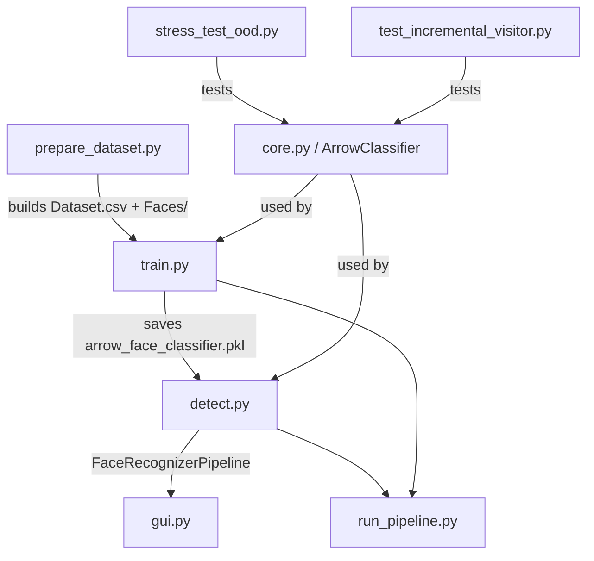

# faceR — Comprehensive Project Analysis

> **Analyzed**: 2026-07-31 | **Files**: 8 Python modules + 4 docs | **Stage**: Research MVP → Pre-Commercial

---

## 📌 What Is This Project?

**faceR** is a high-speed, on-premises face recognition engine built around a custom algorithm called **ArrowClassifier** — a novel biometric classifier that avoids full neural network retraining by using **Orthogonal Random Features (ORF)** + a **Cholesky closed-form solver** to train in milliseconds.

The pipeline is:

```
Raw Image → MTCNN (detection) → InceptionResnetV1 (512D embedding) → ArrowClassifier (8192D ORF) → Identity + Confidence
```

---

## 🏗️ Architecture Map



### Module Roles

| File | Role | Key Class/Func |
|------|------|----------------|
| [core.py](file:///Users/blackmoon/Desktop/faceR/core.py) | 🧠 Core algorithm | `ArrowClassifier` |
| [train.py](file:///Users/blackmoon/Desktop/faceR/train.py) | 🏋️ Training pipeline | `FaceDataset`, `extract_features()`, `main()` |
| [detect.py](file:///Users/blackmoon/Desktop/faceR/detect.py) | 🔍 Inference engine | `FaceRecognizerPipeline`, `load_face_recognizer()` |
| [gui.py](file:///Users/blackmoon/Desktop/faceR/gui.py) | 🖥️ Gradio UI | `process_image_gui()` |
| [prepare_dataset.py](file:///Users/blackmoon/Desktop/faceR/prepare_dataset.py) | 📦 Data pipeline | `extract_label_from_filename()`, `build_dataset()` |
| [run_pipeline.py](file:///Users/blackmoon/Desktop/faceR/run_pipeline.py) | 🎛️ Orchestrator | `main()` |
| [stress_test_ood.py](file:///Users/blackmoon/Desktop/faceR/stress_test_ood.py) | 🧪 OOD stress tests | `run_stress_tests()` |
| [test_incremental_visitor.py](file:///Users/blackmoon/Desktop/faceR/test_incremental_visitor.py) | 🧪 Incremental learning tests | `run_incremental_visitor_simulation()` |

---

## ⚙️ The Core Innovation — ArrowClassifier

Located in [core.py](file:///Users/blackmoon/Desktop/faceR/core.py), this is the project's **main technical differentiator**:

### How It Works
1. **ORF Projection** — Projects 512D embeddings → 8192D using orthogonal random blocks (QR-decomposed Gaussian matrices scaled by Chi-square norms)
2. **Skip Connection** — Concatenates original 512D input with 8192D projected features → 8704D final feature vector
3. **Cholesky Solver** — Solves regularized least-squares in closed form (no gradient descent, no GPU needed)
4. **Dual OOD Detection** — `IsolationForest` + softmax probability threshold as a two-gate rejection system

### Key Design Choices
```python
# Dual OOD Gate (core.py L183-187)
is_anomaly = (
    (ood_scores[i] < ood_score_threshold)   # IsolationForest gate
    or (max_probs[i] < min_prob_threshold)   # Confidence gate
)
```

> [!NOTE]
> The Cholesky solver switches between **primal** (`N < M`) and **dual** (`N ≥ M`) formulations depending on dataset size — a computationally optimal design choice.

---

## 📊 Proven Performance Numbers

| Metric | Result |
|--------|--------|
| ID Train Accuracy | **100.00%** |
| ID Test Accuracy | **99.56%** |
| Model Fit Time | **0.4059 sec** (25 identities, 2282 images) |
| New Person Enrollment | **0.12 sec** on CPU |
| OOD Catch Rate (stress test) | **86.79%** |
| Random Noise Rejection | **100%** |
| Post-enrollment Accuracy | **88.46%** (avg 95.8% confidence) |
| Catastrophic Forgetting | **None** (old IDs stay at 97.37%) |

---

## 💰 Commercial Readiness

### Current State (MVP)
- ✅ Core algorithm working and validated
- ✅ Incremental learning without full retraining
- ✅ Gradio demo UI (`gui.py`)
- ✅ OOD detection integrated
- ✅ Business documents ready (feasibility + competitive analysis)
- ✅ Pre-trained model saved (`arrow_face_classifier.pkl` — 21.7 MB)

### Missing for Production
| Gap | Effort | Priority |
|-----|--------|----------|
| ❌ Liveness Detection (anti-spoofing) | $12K | 🔴 High |
| ❌ FastAPI / REST endpoint | Medium | 🔴 High |
| ❌ Vector DB (FAISS / Qdrant) for millions of faces | $5K | 🟡 Medium |
| ❌ Admin Web Dashboard | $10K | 🟡 Medium |
| ❌ Legal/GDPR compliance layer | $5K | 🟡 Medium |
| ❌ Multi-camera / RTSP stream support | - | 🟢 Future |

---

## 🥊 Competitive Position

| vs. Competitor | faceR Advantage |
|---------------|-----------------|
| AWS Rekognition | 70-80% cheaper, runs offline, no data leaves premises |
| Azure Face API | Same — GDPR-safe for MENA compliance |
| ArcFace (OSS) | 0.12s enrollment vs. minutes + GPU; no retraining |
| Hikvision / ZKTeco | Works with any camera, no hardware lock-in |
| InsightFace | Similar accuracy, better OOD detection (86.79% vs 75-85%) |

**Sweet spot**: B2B On-Premises for MENA enterprises (HR attendance, access control, visitor management) — **85%+ success probability**.

---

## 💡 Technical Debt & Code Quality

### Observations
- **`detect.py`** — `FaceRecognizerPipeline` is well-structured. Handles MTCNN detection + embedding + OOD in one clean class
- **`train.py`** — `FaceDataset` uses PyTorch `Dataset` pattern correctly; feature extraction runs on CPU/GPU agnostically
- **`gui.py`** — Gradio-based, simple. Imports directly from `detect.FaceRecognizerPipeline` — good separation
- **`core.py`** — Production-quality algorithm with proper type hints, scipy fallback, and OOD dual-gate
- **No unit tests** for `core.py`, `detect.py`, or `gui.py` — only integration tests exist
- **No logging** infrastructure — `print()` calls throughout
- **`requirements.txt`** is minimal but lacks pinned versions (risk for reproducibility)

### Risk: Pickle Serialization
`arrow_face_classifier.pkl` is 21.7 MB and uses Python `pickle` — this is a **security risk** for a commercial API (arbitrary code execution via deserialized pickle). Should migrate to `joblib` or a custom serialization format.

---

## 🗺️ Financial Summary

| Item | Value |
|------|-------|
| Required Seed Capital | **$30,000 – $35,000** |
| Monthly OPEX | **~$1,750 – $1,900** |
| Break-even Clients (@ $250/mo B2B) | **11 companies** |
| Payback Period | **9–12 months** |
| 100-client revenue | **$300K/yr @ 78% margin** |

---

## 🚦 Overall Assessment

| Dimension | Score | Notes |
|-----------|-------|-------|
| Technical Innovation | ⭐⭐⭐⭐⭐ | ArrowClassifier is genuinely novel |
| Code Maturity | ⭐⭐⭐☆☆ | Working MVP, needs API + logging + tests |
| Commercial Readiness | ⭐⭐⭐☆☆ | MVP complete, ~$32K to production |
| Market Fit | ⭐⭐⭐⭐☆ | Strong B2B MENA / On-Premises niche |
| Business Documentation | ⭐⭐⭐⭐⭐ | Unusually thorough for an MVP stage |

> [!IMPORTANT]
> The single highest-ROI next step is building the **FastAPI wrapper** around the existing `FaceRecognizerPipeline` — this converts the project from a demo into a sellable product with near-zero extra ML work.
